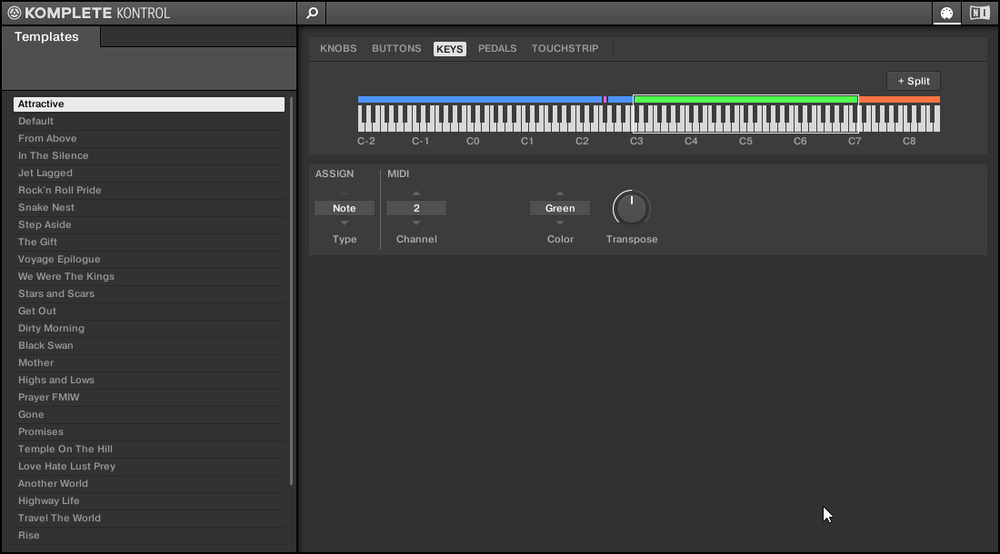
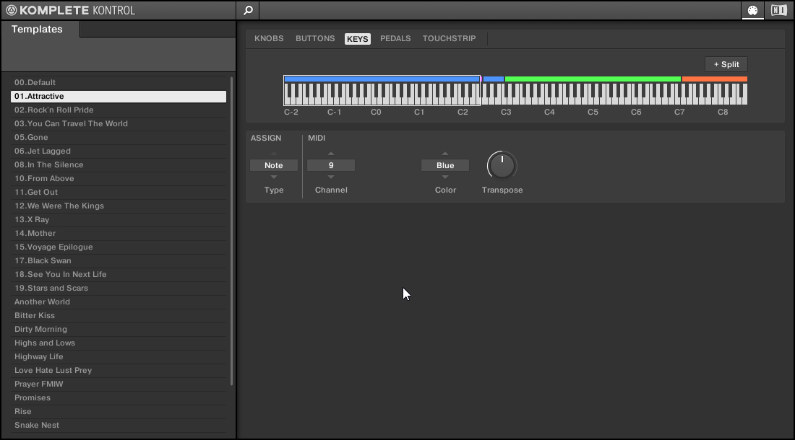

# Komplete Kontrol Template Sorter

This tool sorts the templates (keyboard layouts) from Komplete Kontrol in alphabetical order, by their name.

## What is this for?

I use my Komplete Kontrol Keyboard during live shows. For each song, I created
a Komplete Kontrol template which allows me to set split points and have different midi channels across the keyboard. This is very handy to play multiple instruments on one keyboard.

When I play live, I like to change the layout very quickly between songs. Best is to use the PRESET up/down keys on the keyboard, but for that the templates have to be sorted following the order of the setlist.

With this tool, I just have to:

- Rename each template with a number on the front (00.Default, 01.first song, 02.second song, ...) from Komplete Kontrol
- Use the tool to sort the Komplete Kontrol settings file
- Play!

## Usage

- Rename your templates as needed in Komplete Kontrol
- Go to the folder where KK settings file (`Komplete Kontrol MK2 Settings.dat`) is located: `C:\ProgramData\Native Instruments\Komplete Kontrol` on Windows
- Download the Python script there
- Run the script
- A new `.dat` file is created: `Komplete Kontrol MK2 Settings-sorted.dat`
- After you made a proper copy of the original, replace `Komplete Kontrol MK2 Settings.dat` with the new file

Note: the original file is never changed by the script itself.

This is how it looks for me:

